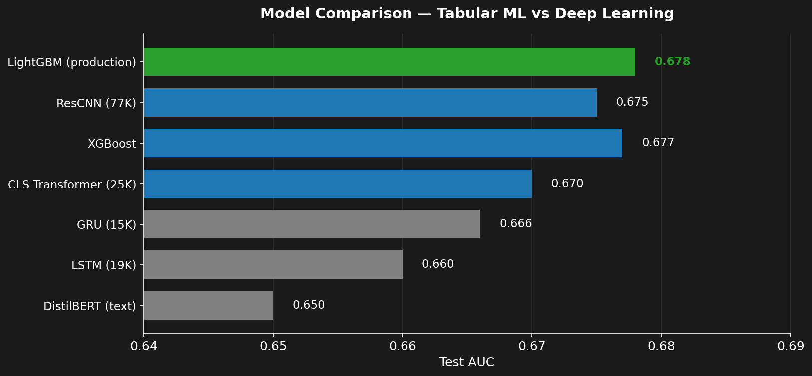
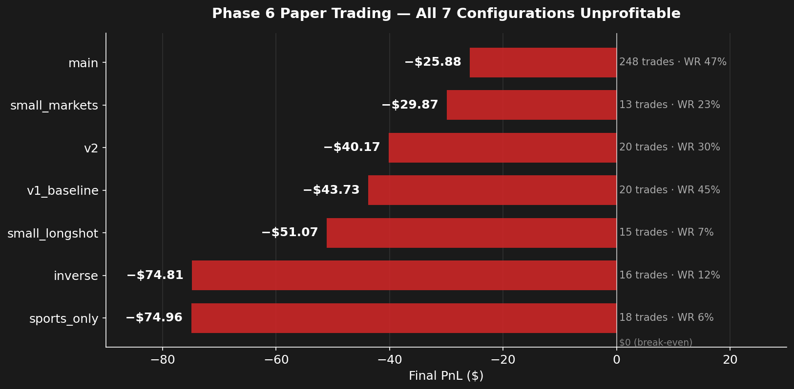
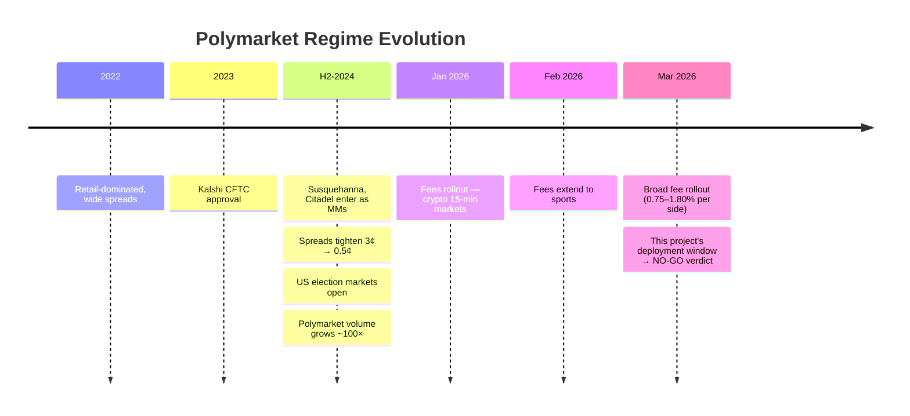

# Prediction Market ML Trading System

> End-to-end ML system for prediction market trading. **521K markets** ingested · **78 engineered features** · **7 model architectures** evaluated · walk-forward validated · deployed live to a VPS with A/B testing.

> **Verdict: NO-GO** — backtest edge collapsed **86×** under live conditions (alpha decay + 2026 fee rollout). Project documents the rigorous research-stop, not a profitable strategy.

## Highlights

- **Walk-forward validated (offline)**: 5/5 windows profitable, permutation test **p = 0.003**, **$8.61/trade** out-of-sample edge
- **LightGBM production model** with test AUC **0.678** — beats every deep-learning architecture on tabular features
- **8-day live deployment** on Ubuntu VPS: 7 strategies in parallel, checkpointing, auto-restart, equity tracking
- **Rigorous validation pipeline**: PurgedKFold (AFML), Platt + isotonic calibration, Monte Carlo stress test, **Deflated Sharpe Ratio** (López de Prado Ch.8)
- **Production-grade engineering**: 117 tests, half-Kelly risk manager, fee-aware backtest, FinBERT sentiment features
- **Identified data leakage** in metadata-only model variant — flagged and rejected
- **Honest validation**: live data revealed an edge collapse — research-stop decision before any real capital was deployed

---

## ML Pipeline

```
Data Collection         3 REST APIs + WebSocket + NLP (Google News RSS, FinBERT)
       ↓
Data Processing         521K markets, 4.2GB raw data, validation, deduplication
       ↓
EDA                     Stationarity testing, whale detection, fat tails, cointegration
       ↓
Feature Engineering     78 features: price/technical, volume, NLP sentiment, cross-market
       ↓
Modeling                LightGBM · XGBoost · CNN 1D · Transformer (LSTM, GRU, DistilBERT also evaluated)
       ↓
Validation              PurgedKFold (AFML), walk-forward (5/5), calibration (Platt, isotonic)
       ↓
Backtesting             Fee-aware simulation, half-Kelly sizing, Monte Carlo stress test
       ↓
Deployment              VPS (Ubuntu), tmux auto-restart, checkpoint/resume, equity logging
       ↓
Paper Trading A/B       7 configs in parallel, 350+ live trades over 8 days
       ↓
Quality & Analysis      Deflated Sharpe Ratio (López de Prado Ch.8), root cause analysis
```

---

## Key Results

| Stage | Metric | Value |
|:------|:-------|------:|
| Classical ML | LightGBM test AUC (TB labels) | **0.678** |
| Classical ML | XGBoost test AUC | 0.677 |
| Deep Learning | ResCNN test AUC | 0.675 |
| Walk-Forward (5 windows) | Mean AUC | 0.683 ± 0.025 |
| Walk-Forward | Profitable windows | **5 / 5** |
| Backtest (HTR cost model) | Flat-bet edge per trade | **$8.61** |
| Backtest | Permutation test p-value | **0.003** |
| Backtest | Win rate / Profit factor | 79% / 2.22 |
| Validation | Identified data leakage in metadata-only model | flagged → rebuild |
| Paper Trading (main, 8 days) | Trades / PnL / WR | **248 / −$25.88 / 47%** |
| Paper Trading | All 7 configs | **all unprofitable** |
| Paper Trading | Deflated Sharpe Ratio | **−0.86** (not significant) |
| Verdict | Phase 7 (live) | **NO-GO** |

---

## Model Comparison



LightGBM beats every DL architecture on tabular features. DistilBERT has value only as a stacking feature (uncorrelated text signal), not standalone.

---

## Paper Trading — Case Study (Phase 6)

### The core finding: 86× edge collapse

| Stage | Per-trade edge |
|---|---:|
| Backtest (2024–early-2025 data) | **+$8.61** |
| Paper trading (2026 deployment) | **−$0.10** |
| **Decay factor** | **−86×** |

This is the project's most important number — it quantifies how much regime change between data collection and deployment cost the strategy. Detailed analysis below.

### Setup

7 configurations on a VPS, $1,000 starting capital each, half-Kelly sizing, 8 days live.



| Config | Strategy | Trades | PnL | WR | Max DD |
|--------|----------|-------:|----:|---:|------:|
| main | HTR + all exits | 248 | **−$25.88** | 47% | −12.1% |
| v1_baseline | HTR clean start | 20 | −$43.73 | 45% | −5.5% |
| v2 | HTR + 5 exit-rule fixes | 20 | −$40.17 | 30% | −4.8% |
| small_markets | Low-liquidity filter | 13 | −$29.87 | 23% | −5.0% |
| small_longshot | Longshots on small markets | 15 | −$51.07 | 7% | −5.0% |
| sports_only | Sports category only | 18 | −$74.96 | 6% | −7.2% |
| inverse | Inverted signal (sanity check) | 16 | −$74.81 | 12% | −7.2% |

**Per-trade asymmetry**: `main` loses **−$0.10/trade**, `inverse` loses **−$4.68/trade** — a **47× gap**. The HTR signal carries directional information (otherwise inversion would not amplify losses); the live edge exists but is too small to overcome fees and spread in the 2026 regime. `sports_only` (WR 6%, 18 trades) confirms zero edge on sports specifically.

> **Statistical caveat.** Only `main` (248 trades) is a robust sample; the other configs (13–20 trades) are directional indicators, not statistical conclusions. The NO-GO verdict rests on `main` + Deflated Sharpe Ratio + the 7-config consistency, not on any single small-N config.

### Why backtest ≫ paper: alpha decay from institutional flow

Backtest data spans the 2024–early-2025 regime; paper trading hit a structurally different market in 2026. The ~1-year gap between training-data cutoff and deployment was intentional: retraining on 2026 data with institutional MMs already present would not have changed the structural conclusion (alpha decay is regime-level, not data-level). Deployment served as confirmation, not as a fresh training experiment.



| Regime change (2024–2025) | Effect on retail edge |
|---|---|
| Susquehanna, Citadel Securities, Jane Street entered prediction markets as market makers | Tightened spreads from ~3¢ to ~0.5¢ on liquid markets |
| Polymarket native market-making program + maker rebates launched | Professional flow captures most provided liquidity |
| Kalshi CFTC approval (2023) → US institutional access; election markets opened H2-2024 | Order books deepen, mean-reversion half-life collapses |
| Polymarket volume grew ~100× (2022 → 2024) | Inefficiencies that existed in retail-dominated regime get arbed in seconds |
| **Polymarket rolled out taker fees across most categories (Jan–Mar 2026)** | 0.75% (sports) to 1.80% (crypto) per side; geopolitics is the only fee-free category remaining |

**Fee rollout timeline.** Jan 2026 — fees first introduced on 15-minute crypto markets to fund the maker-rebate program. Feb 18, 2026 — extended to select sports markets (NCAAB, Serie A). Mar 30, 2026 — broad rollout across crypto, sports, politics, economics, finance, culture, weather, tech, mentions. Mar 31 — calculation switched from USD-volume to share-based, but fees themselves remained. Maker rebates of 20–25% of collected fees go to limit-order providers (so providing liquidity is still marginally profitable; taking it is not).

**Implication for this project.** The HTR signal is a slow mean-reversion detector trained on the inefficient era. By deployment, professional MMs were filling the same mispricings before the model could trade them — most of the residual edge belongs to whoever provides liquidity fastest. The 2026 fee rollout adds a 1.5–3.6% round-trip cost on top, which **structurally exceeds the per-trade edge** for retail taker strategies. Continuing to develop this approach on Polymarket is no longer economically viable: alpha decay (López de Prado, *Advances in Financial Machine Learning*, Ch.11) compounded with explicit transaction costs has moved the platform out of reach for this class of model.

### Deflated Sharpe Ratio (López de Prado Ch.8)

Standard Sharpe Ratio is biased upward when many strategies are tested in parallel (Optuna 50 trials × 2 model families + manual sweeps = effective ~100 independent trials). The Deflated SR compares the observed SR against the *expected maximum* SR from N random trials — a multiple-testing correction. Here it confirms paper trading SR is statistically indistinguishable from a random strategy's worst case:

```
SR_observed:  -0.860     ← paper trading produced a negative SR
E[max SR]:    +2.751     ← even random search of 100 strategies would expect a higher max
z:           -25.01
p-value:       0.000
significant:   False     ← cannot reject H₀ that strategy ≤ random  →  NO-GO
```

**Note on the apparent contradiction with backtest p=0.003.** The two p-values test different null hypotheses on different datasets:

| Test | Dataset | H₀ | Result |
|---|---|---|---|
| Permutation test | Backtest trades | Returns are random label permutation | Reject (p=0.003) → backtest signal is real |
| Deflated SR | Paper trading | SR ≤ E[max SR over N=100 trials] | Cannot reject → live SR no better than random search |

Permutation test does not correct for multiple testing across strategy variants; DSR does. The backtest result was statistically significant *unconditionally*, but failed once corrected for the ~100 variants tried during research. Live deployment confirmed DSR's stricter verdict — which is why the verdict is NO-GO.

---

## Hybrid Pipeline: Rule-Based + ML

```
┌──────────────────────────────────────────────────────────┐
│  ML Signal Engine                                        │
│  LightGBM → Platt calibration → calibrated P(outcome)   │
├──────────────────────────────────────────────────────────┤
│  Rule-Based Strategies                                   │
│  Mean Reversion · Contrarian · NegRisk Arb · Convergence │
├──────────────────────────────────────────────────────────┤
│  Meta-Labeling Filter (López de Prado, AFML Ch.3)        │
│  P(primary correct) ≥ 0.6 → trade; else skip            │
├──────────────────────────────────────────────────────────┤
│  Risk Manager                                            │
│  Half-Kelly · Drawdown protection · Regime-aware exits   │
└──────────────────────────────────────────────────────────┘
```

---

## Experiments

| ✅ Applied | ❌ Rejected |
|:---|:---|
| Meta-Labeling — WR 60% → 78% (AFML Ch.3) | Trend-Scanning — MR markets ≠ trending |
| Clustered Feature Importance — 10/78 noise | NeuralForecast — convergence-bias in eval |
| Focal Loss γ=1 — recall 19% → 89% | DL ensemble — inter-model corr 0.93 |
| Deflated Sharpe Ratio — validates NO-GO | Metadata-only HTR (v0) — leakage flagged |

---

## Tech Stack

| Layer | Tools |
|-------|-------|
| **ML** | LightGBM, XGBoost, scikit-learn, Optuna, SHAP |
| **DL** | PyTorch (CNN 1D, ResCNN, Transformer; LSTM/GRU/DistilBERT also evaluated), MPS |
| **NLP** | HuggingFace Transformers, FinBERT (ProsusAI/finbert) for sentiment features |
| **Data** | pandas, numpy, polars, DuckDB, httpx, websockets, asyncio |
| **Feature Engineering** | scipy (ADF, Hurst), statsmodels (cointegration, VR), NMI clustering |
| **Visualization** | matplotlib, seaborn, plotly |
| **Deployment** | VPS (Ubuntu 22.04), tmux, SSH, auto-restart, checkpoint/resume |
| **Validation** | PurgedKFold (AFML), walk-forward, Deflated Sharpe Ratio, Monte Carlo |
| **Risk** | Kelly criterion, half-Kelly, drawdown protection, regime detection |
| **APIs** | REST (httpx), WebSocket (websockets), RSS feeds, JSON/JSONL streaming |
| **Testing** | pytest (117 tests) |
| **Version Control** | Git, GitHub, conda (environment.yml) |

---

<details>
<summary><b>Project Structure</b></summary>

```
src/
├── data/           API client, collectors, ETL pipeline
├── execution/      Paper trading engine
├── features/       NLP features, FinBERT sentiment
├── risk/           Risk manager: Kelly, drawdown, regime-aware exits
├── strategies/     Strategies + strategy router + signal engine
└── utils/          Fee model, logging

notebooks/
├── 01_eda/                    6 notebooks
├── 02_feature_engineering/    78-feature pipeline
├── 03_modeling/               LightGBM, XGBoost, calibration
├── 04_backtesting/            HTR strategy, validation, paper trading analysis
├── 05_deep_learning/          CNN 1D, Transformer
└── 06_improvements/           Clustered feature importance
```

</details>

<details>
<summary><b>Notebooks Guide (16 notebooks)</b></summary>

**Headline notebooks (start here):**

| # | Notebook | Why it matters |
|---|----------|------------|
| 4.4 | Paper Trading Analysis | NO-GO verdict + root cause across all 7 A/B configs |
| 4.3 | Validation | Walk-forward 5/5, permutation p=0.003; identified leakage in v0 |
| 3.1 | Classical ML | LGB AUC = 0.678 with PurgedKFold + Optuna |
| 6.1 | Clustered Feature Importance | NMI + ONC, 10/78 features = noise |

**Full list:**

| # | Notebook | Key Result |
|---|----------|------------|
| 1.1 | Market Overview | 50,896 markets, $4.45B volume |
| 1.2 | Resolved Markets | 321K resolved, YES bias +0.217 |
| 1.3 | Price Dynamics | 77% mean-reverting (VR<1), kurtosis ≈ 4140 |
| 1.4 | Strategy Conclusions | Contrarian SR baseline, momentum loses money |
| 1.5 | Trader Analysis | Whale Gini = 0.918, top 1% = 61.5% volume |
| 1.6 | Risk Analysis | Slippage model R² = 0.32 |
| 2.1 | Feature Engineering | 78 features, time-based split |
| 3.1 | Classical ML | LGB AUC = 0.678, Optuna, PurgedKFold |
| 3.2 | Advanced Modeling | Calibration, stacking, walk-forward |
| 4.1 | Backtesting | Fee-aware HTR cost model |
| 4.2 | Model Improvement | LGB v3 + volume features, calibration |
| 4.3 | Validation | Walk-forward 5/5 profitable, p=0.003; identified leakage in v0 |
| 4.4 | Paper Trading Analysis | 7 A/B configs, NO-GO verdict, root cause |
| 5.1 | CNN 1D Time Series | ResCNN AUC = 0.675 |
| 5.2 | Transformer Time Series | CLS Transformer AUC = 0.670 |
| 6.1 | Clustered Feature Importance | NMI + ONC, 10/78 features = noise |

</details>

---

## Data & Setup

```bash
conda env create -f environment.yml
conda activate polymarket

jupyter lab notebooks/
python scripts/collect_data.py --limit 500 --prices-days 90
pytest tests/ -v
```

See [docs/data_guide.md](docs/data_guide.md).

## License

MIT
